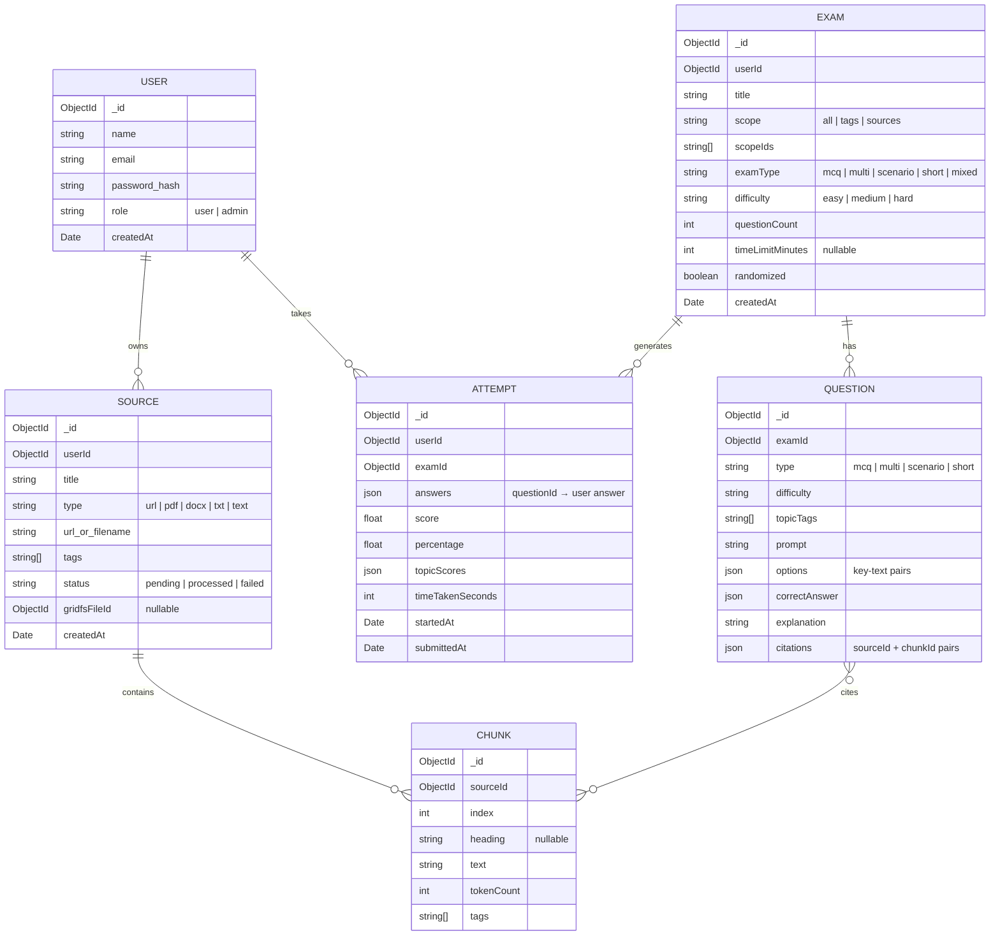

# KnowTrial — Architecture

## Tech Stack

| Layer | Technology | Version |
|-------|-----------|---------|
| **Runtime** | Node.js | 20+ |
| **Backend** | Express | 5.x |
| **Database** | MongoDB Atlas + GridFS | 8.x (Mongoose) |
| **Frontend** | Next.js (App Router) | 15.x |
| **UI** | React | 19.x |
| **State** | Zustand | 5.x |
| **CSS** | Tailwind CSS | 4.x |
| **Components** | shadcn/ui (Radix primitives) | — |
| **Auth** | bcryptjs + JWT | — |
| **AI/LLM** | OpenAI / Gemini API | TBD |

---

## Folder Structure

```
knowtrial/
├── .github/
│   └── workflows/
│       └── ci.yml                  # CI/CD pipeline
├── backend/
│   ├── src/
│   │   ├── config/                 # DB connection, env config
│   │   ├── controllers/            # Route handlers
│   │   ├── middleware/              # auth (protect, adminOnly), validation
│   │   ├── models/                  # Mongoose schemas
│   │   ├── routes/                  # Express routers
│   │   ├── services/                # Business logic (chunking, LLM, scoring)
│   │   ├── utils/                   # Helpers (text extraction, schema validation)
│   │   └── index.js                 # Entry point
│   ├── eslint.config.mjs
│   └── package.json
├── frontend/
│   ├── src/
│   │   ├── app/                     # Next.js App Router pages
│   │   │   ├── (auth)/              # Login, Register (unprotected group)
│   │   │   ├── dashboard/           # Dashboard page
│   │   │   ├── library/             # Study Library + Source Viewer
│   │   │   ├── exams/               # Exam Builder, Taking, Results
│   │   │   ├── history/             # Attempts History
│   │   │   ├── practice/            # Weakness Practice
│   │   │   ├── admin/               # Admin panel
│   │   │   ├── layout.tsx           # Root layout
│   │   │   └── page.tsx             # Landing / redirect
│   │   ├── components/
│   │   │   ├── ui/                  # shadcn primitives (button, dialog, etc.)
│   │   │   ├── layout/              # Header, Sidebar, Footer
│   │   │   ├── library/             # Source cards, add-source modal, chunk viewer
│   │   │   ├── exam/                # Builder form, question card, timer, nav
│   │   │   ├── results/             # Score summary, review panel, citation modal
│   │   │   └── analytics/           # Charts, stats cards, trend lines
│   │   ├── lib/                     # Utilities (api client, cn, formatters)
│   │   └── store/                   # Zustand stores
│   │       ├── authStore.ts
│   │       ├── libraryStore.ts
│   │       ├── examStore.ts
│   │       └── analyticsStore.ts
│   ├── eslint.config.mjs
│   └── package.json
├── docs/
│   ├── prompt.md                    # Original requirements
│   └── ROADMAP.md                   # Phase-by-phase roadmap
├── .clinerules/                     # AI coding conventions
└── .gitignore
```

---

## Database Collections



---

## Data Flow

### Content Intake Pipeline
```
User adds source (URL / File / Text)
        │
        ▼
  POST /api/sources
        │
        ├── URL → scrape & extract text
        ├── File → store in GridFS → extract text (pdf-parse / mammoth)
        └── Text → store directly
        │
        ▼
  Chunking Engine (split by heading/token limit)
        │
        ▼
  Store Chunks in MongoDB
        │
        ▼
  Update Source status → "processed"
```

### Exam Generation Flow
```
User configures exam (scope, type, count, difficulty)
        │
        ▼
  POST /api/exams/generate
        │
        ▼
  Retrieve relevant chunks (by scope/tags)
        │
        ▼
  LLM generates questions (grounded in chunks, with citations)
        │
        ▼
  Validate each question against JSON schema
        │
        ▼
  Store Exam + Questions in MongoDB
        │
        ▼
  Return exam to frontend for taking
```

---

## API Route Map

| Method | Route | Auth | Description |
|--------|-------|------|-------------|
| `POST` | `/api/auth/register` | Public | Register user |
| `POST` | `/api/auth/login` | Public | Login, returns JWT |
| `GET` | `/api/auth/me` | Protected | Get current user |
| `GET` | `/api/sources` | Protected | List user's sources |
| `POST` | `/api/sources` | Protected | Add source (URL/file/text) |
| `GET` | `/api/sources/:id` | Protected | Get source + chunks |
| `DELETE` | `/api/sources/:id` | Protected | Delete source |
| `GET` | `/api/sources/:id/chunks` | Protected | List chunks for source |
| `POST` | `/api/exams/generate` | Protected | Generate exam |
| `GET` | `/api/exams` | Protected | List user's exams |
| `GET` | `/api/exams/:id` | Protected | Get exam + questions |
| `POST` | `/api/attempts` | Protected | Submit attempt |
| `GET` | `/api/attempts` | Protected | List user's attempts |
| `GET` | `/api/attempts/:id` | Protected | Get attempt with review |
| `POST` | `/api/exams/weakness` | Protected | Generate weakness quiz |
| `GET` | `/api/analytics` | Protected | User analytics summary |
| `GET` | `/api/admin/sources` | Admin | All sources |
| `POST` | `/api/admin/sources/:id/retry` | Admin | Retry failed processing |
| `GET` | `/api/admin/tags` | Admin | Manage tags |
